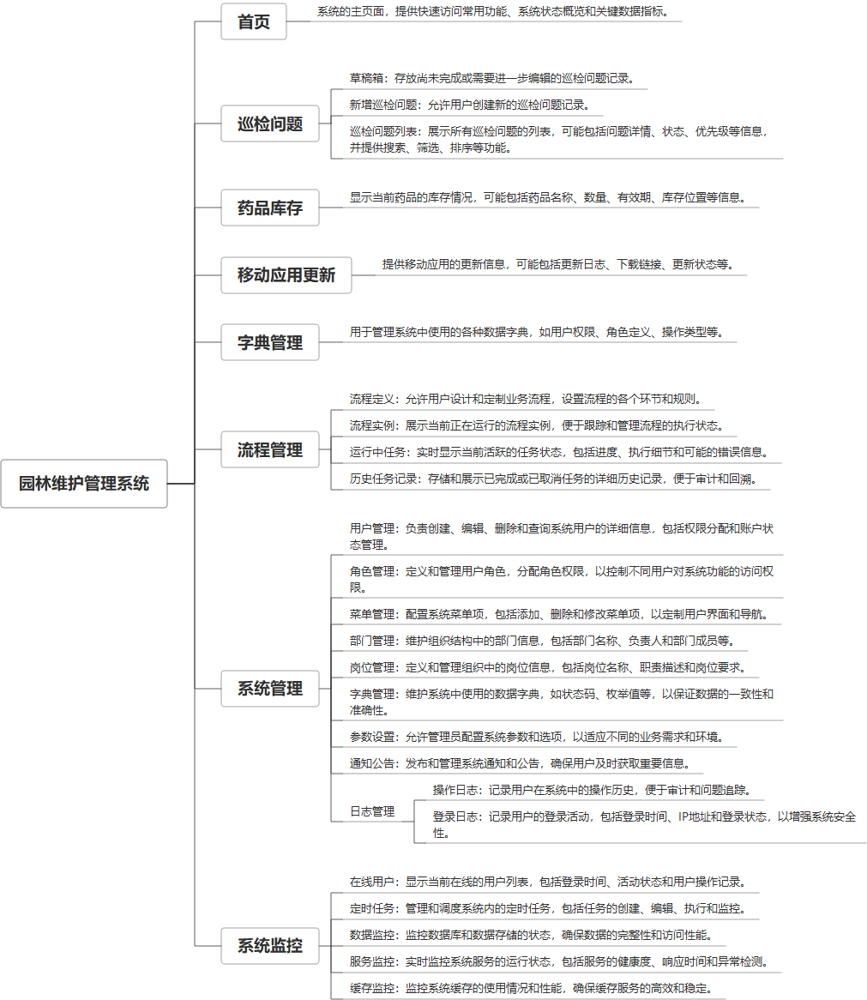

 

    
 

公司拥有上百套具有自主知识产权的软件系统，详情请查看码云首页或公司官网

 
<h1>园区维护管理</h1>

<a href="https://www.haishi.net.cn/">公司官网</a> ｜ <a href="https://www.haishi.net.cn/">在线体验</a>

 

## 系统介绍

园区维护管理系统是一款专注于园区设施与资源维护的综合性管理工具，它集成了巡检问题管理、流程定义与实例、任务运行监控、历史任务记录以及车辆信息管理等功能。系统支持巡检问题的查询、新增、修改、删除和导出，同时提供流程定义与实例的全程管理，确保园区维护工作的标准化和流程化。此外，系统还涵盖了运行中任务和历史任务记录的监控，以及车辆信息的维护，为园区提供高效的维护管理手段和决策支持，保障园区设施的正常运行和资源的高效利用。
园区巡检、问题上报、问题解决、药品\车辆管理等功能
---
本项目名称为园林维护管理系统，是一款用于园林维护管理的软件。该系统适用于园林管理部门、维护公司等，它主要包括巡检问题管理、药品库存管理、移动应用更新、字典管理、流程管理、系统管理等模块。该系统可以提高园林维护效率，降低维护成本。
本项目从用户层面可以分为一个端：
- 管理端：公司内部管理员用户使用，可以进行基础数据维护、巡检问题管理、药品库存管理、流程管理等。
---
                

## 系统功能介绍

### 系统包含终端说明

管理端（WEB）

| 序号 | 模块 | 模块说明 |
| --- | --- | --- |
| 1 | QHY-YQWH-GY-SERVER | 服务端 |
| 2 | QHY-YQWH-GY-MANAGE | 管理端 |

### 系统功能结构

### 系统功能说明

- 巡检问题管理： 包括草稿箱、新增巡检问题、巡检问题列表等功能，可以方便地对巡检过程中发现的问题进行记录和处理。
- 药品库存管理： 可以对园林维护过程中使用的药品进行库存管理，包括入库、出库、库存查询等功能。
- 流程管理：  包括流程定义、流程实例、运行中任务、历史任务记录等功能，可以自定义各种业务流程，例如巡检问题处理流程、药品采购流程等。
- 系统管理： 包括用户管理、角色管理、菜单管理、部门管理等功能，可以对系统进行管理和维护。

## 系统主要界面

## 系统技术说明

### 代码模块说明

| 序号 | 目录 | 目录说明 |
| --- | --- | --- |
| 1 | QHY-YQWH-GY-SERVER/px-landscape-process | -- |
| 2 | QHY-YQWH-GY-SERVER/px-landscape-framework | -- |
| 3 | QHY-YQWH-GY-SERVER/px-landscape-service | -- |
| 4 | QHY-YQWH-GY-SERVER/px-landscape-admin | -- |
| 5 | QHY-YQWH-GY-SERVER/px-landscape-api | -- |
| 6 | QHY-YQWH-GY-SERVER/px-landscape-generator | -- |
| 7 | QHY-YQWH-GY-SERVER/px-landscape-quartz | -- |
| 8 | QHY-YQWH-GY-SERVER/px-landscape-common | -- |
| 9 | QHY-YQWH-GY-SERVER/px-landscape-system | -- |
| 10 | QHY-YQWH-GY-SERVER/.idea | -- |

### 系统技术选型

#### 开发语言/框架

JAVA（JDK1.8）
前端框架：VUE2

#### 服务中间件

Nginx
Tomcat

#### 数据库

MySQL（5.7+）

#### 其他说明

无

## 系统演示/商用

请扫码添加客服微信获取演示地址和系统详细资料。

如果您想基于园区维护管理进行商业化交付或定制开发服务，我们提供有偿的技术服务支持，合作模式不限，欢迎沟通！

公司官网地址： <a href="https://www.haishi.net.cn/">https://www.haishi.net.cn</a>

联系客服获取专业回答。

## 使用须知

1、 本项目商用必须获得版权所有者的授权。

2、 未经允许本项目代码不允许二次出售。

